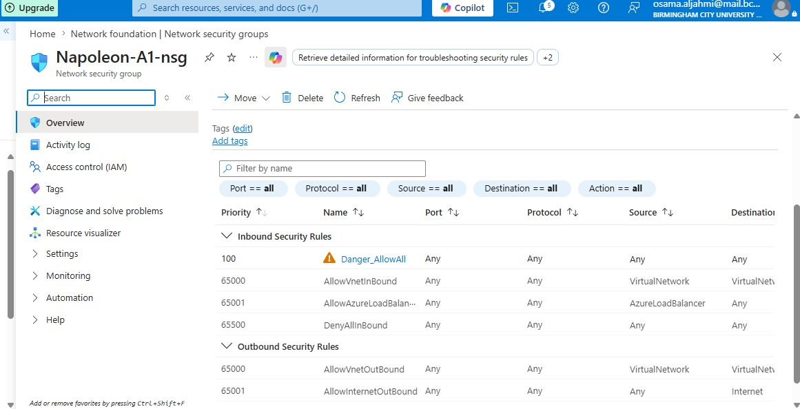
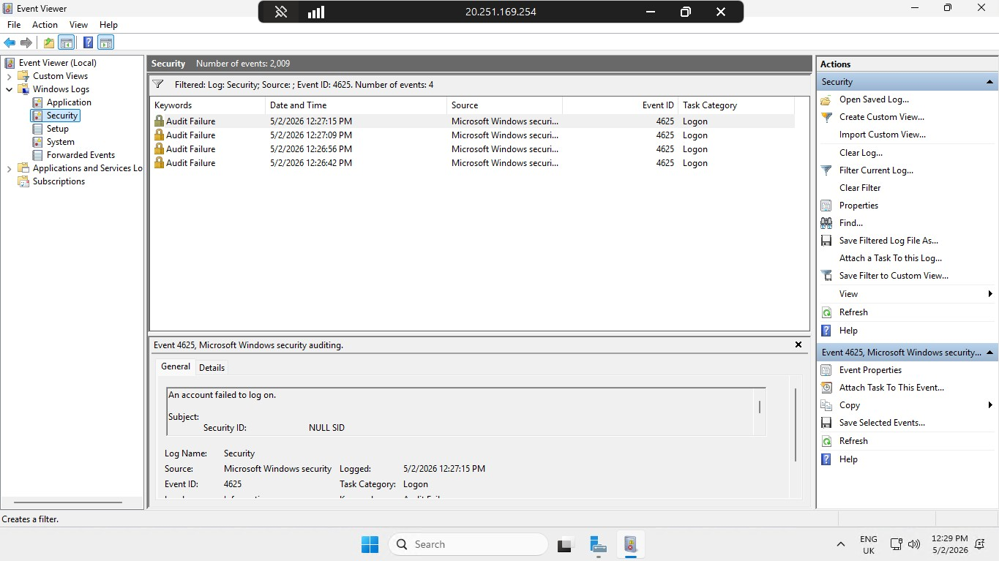
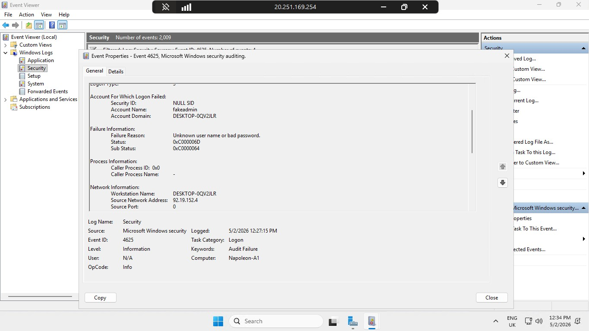
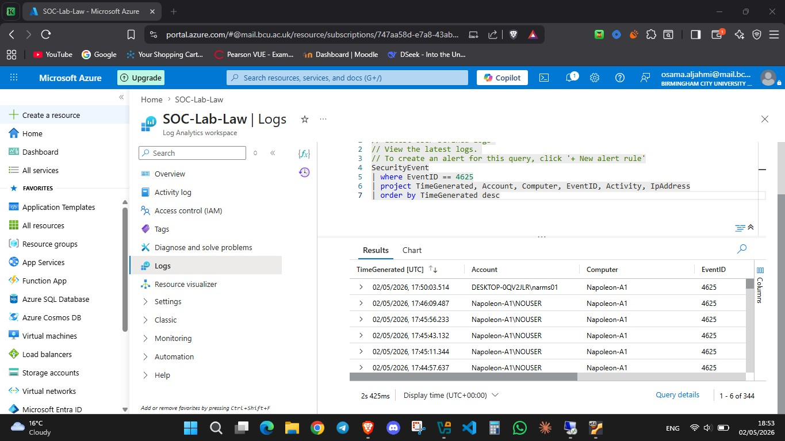
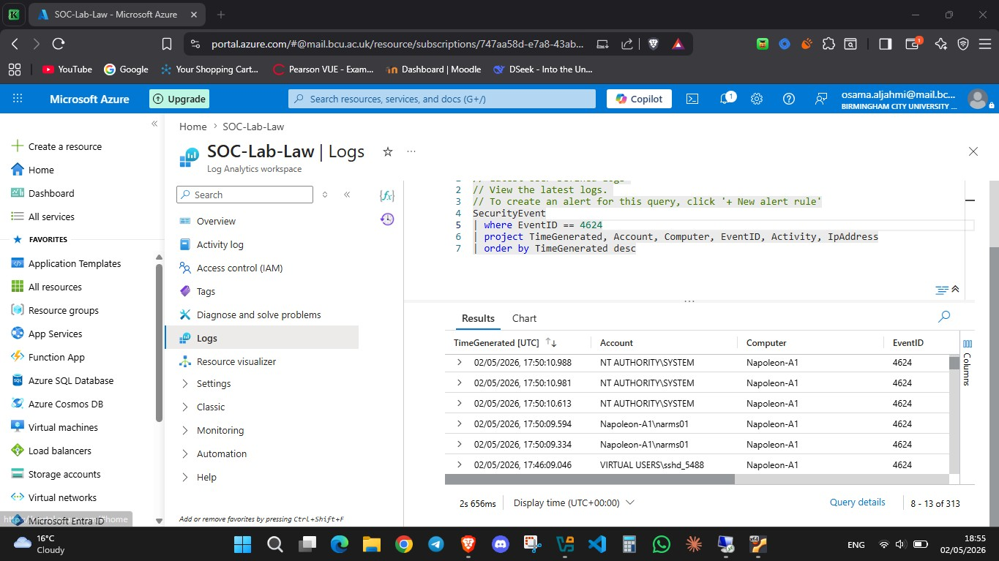

# Azure Sentinel Honeypot Lab 🛡️

**Author:** Osm191
**Date:** May 2026  
**Platform:** Microsoft Azure  
**Tools:** Microsoft Sentinel, Log Analytics, Azure Monitor Agent, Nmap, Hydra, KQL  

---

## Project Overview

This project documents a hands-on cloud security lab in which a deliberately exposed Windows Server virtual machine was deployed on Microsoft Azure as a honeypot. The VM was intentionally misconfigured — all firewall rules removed, Windows Defender Firewall disabled — to attract real-world attacks from the public internet.

Security events were forwarded to a Log Analytics Workspace via the Azure Monitor Agent, queried using KQL (Kusto Query Language) inside Microsoft Sentinel, and enriched with GeoIP data to produce a live attack map visualising the geographic origins of attacks.

The lab demonstrates core SOC analyst skills including cloud infrastructure configuration, SIEM integration, log analysis, threat detection logic, and incident investigation.

---

## Architecture

```
┌─────────────────────────────────────────────────┐
│              Public Internet                     │
│   (Real attackers + Hydra brute force)           │
└──────────────────────┬──────────────────────────┘
                       │ RDP Port 3389
                       ▼
┌─────────────────────────────────────────────────┐
│         Azure VM — Napoleon-A1                   │
│         Windows Server 2025                      │
│         Norway East — Standard_B2als_v2          │
│         NSG: DANGER_AllowAll (all ports open)    │
│         Windows Firewall: Disabled               │
└──────────────────────┬──────────────────────────┘
                       │ Azure Monitor Agent (AMA)
                       │ Data Collection Rule (DCR)
                       ▼
┌─────────────────────────────────────────────────┐
│       Log Analytics Workspace — SOC-Lab-Law      │
│       SecurityEvent table                        │
│       EventID 4625 (failed logons)               │
│       EventID 4624 (successful logons)           │
└──────────────────────┬──────────────────────────┘
                       │
                       ▼
┌─────────────────────────────────────────────────┐
│           Microsoft Sentinel (SIEM)              │
│       KQL queries + GeoIP Watchlist              │
│       Attack Map Workbook                        │
└─────────────────────────────────────────────────┘
```

---

## Tools & Technologies

| Tool | Purpose |
|---|---|
| Microsoft Azure | Cloud platform hosting the honeypot VM |
| Windows Server 2025 | Honeypot operating system |
| Azure NSG | Network Security Group — intentionally misconfigured to allow all traffic |
| Azure Monitor Agent | Forwards Windows Security Events to Log Analytics |
| Log Analytics Workspace | Central log repository and KQL query engine |
| Microsoft Sentinel | SIEM — correlates, analyses and visualises attacks |
| Nmap | Port scanning and service enumeration of the honeypot |
| Hydra | Brute force tool used to generate controlled attack traffic |
| KQL | Kusto Query Language — used to query and analyse security logs |
| GeoIP Watchlist | Maps attacker IP addresses to cities and countries |

---

## Lab Phases

### Phase 1 — VM Configuration & Azure Infrastructure

Created a Resource Group (`SOC-Lab`), Virtual Network (`VNet-SOC-Lab`), and deployed a Windows Server 2025 VM (`Napoleon-A1`) in Norway East. The Network Security Group was then deliberately misconfigured by deleting the default RDP rule and replacing it with a single `DANGER_AllowAll` inbound rule — allowing all traffic on all ports from any source.

**Why this matters:** In a real environment, an NSG rule like this would be a critical severity finding. It removes every layer of network-level protection and exposes every service running on the VM directly to the public internet. Automated internet scanners found and began attacking the VM within hours of deployment.




---

### Phase 2 — Disabling Windows Defender Firewall

Connected to the VM via RDP and disabled Windows Defender Firewall across all three profiles (Domain, Private, Public) using `wf.msc`. Confirmed the VM was fully reachable from the local machine via ICMP ping.

**Why this matters:** With both the NSG and the Windows Firewall removed, the VM has zero network-level defences. This maximises its visibility to internet scanners and ensures the richest possible attack data flows into the logs.


---

### Phase 3 — Local Security Log Investigation (Event Viewer)

Before connecting Sentinel, explored the local Windows Security logs using Event Viewer. Simulated failed login attempts by deliberately entering wrong credentials via RDP, then filtered the Security log by EventID `4625` to confirm they were captured.

**Key fields observed in a 4625 event:**
- **Account Name** — the username attempted (`fakeadmin`)
- **Failure Reason** — `Unknown user name or bad password`
- **Source Network Address** — the attacker's IP address
- **Workstation Name** — origin machine

This phase established the foundational understanding of how Windows logs authentication events before moving to centralised collection.




---

### Phase 4 — Log Analytics Workspace & Microsoft Sentinel

Created a Log Analytics Workspace (`SOC-Lab-Law`) in Norway East and connected Microsoft Sentinel to it. The workspace acts as the central log database; Sentinel sits on top as the SIEM layer providing querying, analytics rules, and workbook visualisations.


---

### Phase 5 — Azure Monitor Agent & Data Collection Rule

Installed the **Windows Security Events via AMA** solution from the Sentinel Content Hub, then created a Data Collection Rule (`DCR-Windows`) targeting the honeypot VM with `All Security Events` collection mode. Confirmed the Azure Monitor Agent installed successfully on the VM with status `Provisioning succeeded`.

**Why this matters:** Without this step, Sentinel has no visibility into the VM. The AMA agent is the pipeline that takes Windows Security Events from the local event log and streams them into the Log Analytics Workspace in near real time.


---

### Phase 6 — Verifying Log Ingestion with KQL

Confirmed logs were flowing into the workspace by running an initial KQL query against the `SecurityEvent` table. Observed machine accounts, system accounts, and the analyst's own RDP session appearing in results within minutes of the DCR being created.

```kql
SecurityEvent
| take 50
```


---

### Phase 7 — KQL Brute Force Analysis

Queried the workspace to investigate failed and successful logon events. Within hours of deployment, real-world attackers had already begun hitting the honeypot — visible as EventID 4625 entries from external IP addresses.

**Failed logons query:**
```kql
SecurityEvent
| where EventID == 4625
| project TimeGenerated, Account, Computer, EventID, Activity, IpAddress
| order by TimeGenerated desc
```

**Successful logons query:**
```kql
SecurityEvent
| where EventID == 4624
| project TimeGenerated, Account, Computer, EventID, Activity, IpAddress
| order by TimeGenerated desc
```

**Attacker summary by IP:**
```kql
SecurityEvent
| where EventID == 4625
| summarize FailureCount = count() by IpAddress
| where FailureCount > 100
| order by FailureCount desc
```




---

### Phase 8 — Reconnaissance & Controlled Attacks

#### Nmap Port Scan

Performed a full service and OS detection scan against the honeypot from an Ubuntu 24.04 attacker machine:

```bash
sudo nmap -sV -sC -Pn -O -T4 20.251.169.254
```

**Open ports discovered:**

| Port | Service | Significance |
|---|---|---|
| 22/tcp | OpenSSH for Windows 9.5 | Unexpected on Windows — Azure management |
| 135/tcp | Microsoft Windows RPC | Targeted by many Windows exploits |
| 139/tcp | NetBIOS Session Service | Legacy Windows networking |
| 445/tcp | Microsoft-DS (SMB) | Historically targeted — EternalBlue/WannaCry |
| 3389/tcp | RDP (ms-wbt-server) | Primary attack vector for brute force |

The scan also leaked the machine hostname (`Napoleon-A1`), Windows version (`10.0.26100`), and RDP certificate details — all intelligence a real attacker would use to tailor their attack.


#### Hydra Brute Force Attack

Created custom username and password wordlists and ran Hydra against the RDP service to generate controlled attack traffic:

```bash
hydra -L users.txt -P passwords.txt rdp://20.251.169.254 -t 1
```

Hydra successfully identified the valid credentials, generating both EventID 4625 (failed attempts) and EventID 4624 (successful logon) in the Sentinel logs.


---

### Phase 9 — GeoIP Watchlist

Uploaded a GeoIP database as a Sentinel Watchlist (alias: `geoip`) with `network` as the SearchKey. This database maps IP address ranges (CIDR notation) to cities, countries, and coordinates, enabling geographic enrichment of attacker IP addresses directly within KQL queries.

**GeoIP enrichment query:**
```kql
let GeoIPDB_FULL = _GetWatchlist("geoip");
let WindowsEvents =
    SecurityEvent
    | where EventID == 4625
    | order by TimeGenerated desc
    | evaluate ipv4_lookup(GeoIPDB_FULL, IpAddress, network);
WindowsEvents
| project
    TimeGenerated, Computer, AttackerIp = IpAddress,
    cityname, countryname, latitude, longitude
```


---

### Phase 10 — Attack Map

Built an Azure Monitor Workbook using the GeoIP-enriched KQL query with map visualisation configured on latitude/longitude coordinates. The map plots every failed login attempt by geographic origin, sized by attack volume.


---

## Findings

### Attack Timeline
The honeypot was deployed on **2 May 2026**. Real-world attacks began appearing in the logs within hours of deployment — before any controlled testing was performed. This demonstrates how quickly exposed systems on the public internet are discovered by automated scanners.

### Attack Origins
GeoIP enrichment identified attacks originating from multiple countries including:
- 🇵🇱 **Poland** (Jordanow) — `185.156.73.x` — highest volume attacker
- 🇳🇱 **Netherlands** (Tilburg) — `92.63.197.x` — consistent attacker

Note: Geographic attribution does not confirm the attacker's physical location. These IPs may represent VPN exit nodes, proxy servers, or compromised machines operating as part of a botnet.

### Attack Volume
- **Total EventID 4625 entries:** 1,000+ (query limit reached within 7 days)
- **Total EventID 4624 entries:** 313+ successful logon events recorded
- **Usernames targeted by real attackers:** `NOUSER`, `Administrator`, various automated attempts
- **Controlled Hydra attack:** 49 login attempts, 1 successful credential hit

### Key Observations
1. The VM was discovered and attacked within hours — confirming that any internet-exposed RDP service will be targeted almost immediately
2. Attackers used automated tooling — the volume and speed of 4625 events (multiple per second) is impossible for a human operator
3. The `NOUSER` account name appearing in logs indicates attackers were attempting to enumerate valid usernames before credential attacks
4. Port 445 (SMB) being open alongside RDP represents a significantly elevated risk profile given historical vulnerabilities like EternalBlue

---

## KQL Queries Reference

```kql
-- All security events
SecurityEvent
| take 50

-- Failed logon attempts (EventID 4625)
SecurityEvent
| where EventID == 4625
| project TimeGenerated, Account, Computer, EventID, Activity, IpAddress
| order by TimeGenerated desc

-- Successful logon attempts (EventID 4624)
SecurityEvent
| where EventID == 4624
| project TimeGenerated, Account, Computer, EventID, Activity, IpAddress
| order by TimeGenerated desc

-- Top attacking IPs by failure count
SecurityEvent
| where EventID == 4625
| summarize FailureCount = count() by IpAddress
| where FailureCount > 100
| order by FailureCount desc

-- GeoIP enriched attack data
let GeoIPDB_FULL = _GetWatchlist("geoip");
let WindowsEvents =
    SecurityEvent
    | where EventID == 4625
    | order by TimeGenerated desc
    | evaluate ipv4_lookup(GeoIPDB_FULL, IpAddress, network);
WindowsEvents
| summarize FailureCount = count() by AttackerIp = IpAddress,
    cityname, countryname, latitude, longitude
```

---

## Lessons Learned

**Exposed systems are attacked immediately.** The honeypot received real attack traffic within hours of deployment. In a real environment, any misconfigured NSG or firewall rule is not a theoretical risk — it is actively exploited.

**An NSG rule allowing all inbound traffic is a critical finding.** The principle of least privilege must be applied to network security groups. Only required ports should be open, and RDP should never be exposed directly to the public internet — it should sit behind a VPN or bastion host.

**GeoIP enrichment has value and limitations.** While geographic data helps analysts understand attack patterns and correlate with threat intelligence, it cannot be taken as definitive proof of attacker origin. VPNs, proxies, and botnets mean the true attacker location is often obscured.

**KQL is the analyst's primary tool in Sentinel.** The ability to write and interpret KQL queries — filtering by EventID, projecting relevant fields, summarising by attacker IP — is the core skill that separates a productive SOC analyst from someone just watching a dashboard.

**Log volume is noise without context.** 1,000+ raw 4625 events mean nothing without the ability to summarise, filter, and enrich them. The `summarize` operator and GeoIP enrichment are what transform raw log data into actionable intelligence.

**The Cyber Kill Chain maps to real events.** Every stage of the kill chain — Reconnaissance (Nmap), Weaponisation (Hydra setup), Delivery (Hydra execution), Exploitation (successful 4624) — was observable in the logs. Understanding this framework helps analysts understand attacker intent and predict next steps.

---

## Event ID Reference

| Event ID | Description | Significance |
|---|---|---|
| 4625 | An account failed to log on | Failed authentication — brute force indicator |
| 4624 | An account was successfully logged on | Successful authentication — potential compromise |
| 4720 | A user account was created | Persistence mechanism — post-compromise |
| 4732 | A member was added to a security group | Privilege escalation indicator |
| 4688 | A new process has been created | Process execution — hunting for malicious activity |
| 7045 | A new service was installed | Persistence/malware installation indicator |

---

## Cleanup

To avoid ongoing Azure charges after completing the lab:

1. **Stop the VM** — Azure portal → Virtual Machines → Napoleon-A1 → Stop
2. **Delete the Resource Group** — deletes all resources simultaneously:
   - Azure portal → Resource Groups → SOC-Lab → Delete resource group

> ⚠️ This lab is for educational purposes only. The intentional misconfiguration demonstrated here (open NSG, disabled firewall) must never be applied to production environments.

---

## References

- [Microsoft Sentinel Documentation](https://docs.microsoft.com/azure/sentinel/)
- [KQL Reference](https://docs.microsoft.com/azure/data-explorer/kusto/query/)
- [MITRE ATT&CK Framework](https://attack.mitre.org/)
- [Nmap Documentation](https://nmap.org/book/)
- [THC Hydra](https://github.com/vanhauser-thc/thc-hydra)
- Original lab concept: [0xKh4l3d/Azure-Sentinel-Honeypot-Lab](https://github.com/0xKh4l3d/Azure-Sentinel-Honeypot-Lab)
